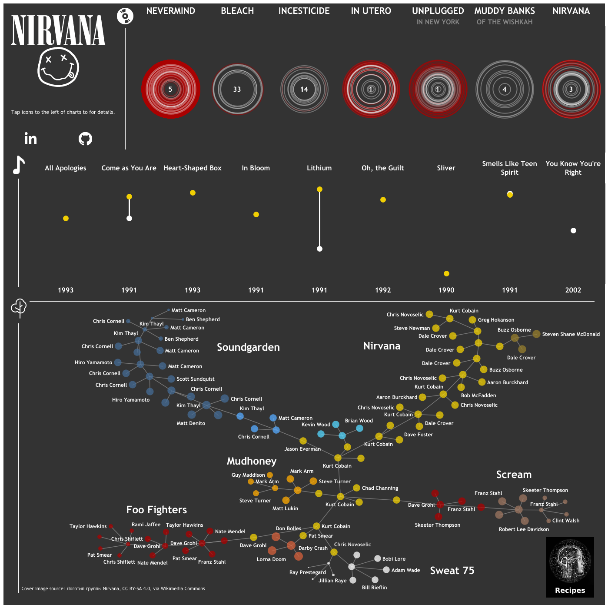

# Background 
This article sets out a simple recipe for visualising a network using Tableau and Gephi. The example used is the network of bands and band members interconnected with Nirvana.

Tableau public is a free to use visualisation tool that can ingest data in a number of different formats and is useful at creating flexible visualisation. Gephi is an open source graphing platform that has a number of algorithms that can automatically spread the points (nodes) of a network and their connecting lines (edges) into set of points that can be combined with other data and visualised in Tableau. You could also create a visual in Gephi, but Tableau has a number of other useful tools.

The inspiration for this approach to network charts came from [this example](https://thedatasurfers.com/2019/08/27/how-to-use-gephi-to-create-network-visualizations-for-tableau/).

See link above to GitHub repository which has data and tableau workbook for this recipe.

# The result

A preview of the final visualisation is below, with a link [here](https://public.tableau.com/app/profile/pat5787/viz/Nirvana_16351886101480/Nirvana?publish=yes).

# What is a network chart?
A visual representation of a network. It comprises nodes (points in the graph) and edges (lines joining the points).

# Structuring data for Gephi
Gephi needs two tables: (1) a table of nodes (here individual band members) and (2) a table of edges i.e. a definition of how those nodes relate to each other.

Our data looks like the below - a record for each band member for a given iteration of the band. Each record has an ID and each record has a parent (the other point we would like that record to connect to). This data table fully defines the data as well as each row's relationship with the other rows.

 

From this data we create two additional tables. The "nodes" table contains each row's ID and its Node (the same value as the ID):

{width=40%}

The "edges" table contains each row's ID its parent or Target ID:

{width=40%}

This is all that Gephi needs (note: Gephi needs the tables as values). 

## Plotting network points in Gephi
Install and open Gephi (see "inspiration" link above for troubleshooting tips on installation). The Gephi start page looks like:

 

You'll want to open a file, loading the nodes (as a "nodes table") first:

 
Load the data into a new workspace as a "Directed" graph type.

Load the edges data into the same workspace as an "Edges" table.

 

You should get something that looks like this in the "Overview" page:

{width=60%}

Then, the magic of Gephi - the "layout" options will space out the points and edges considering the relationships you have specified. There are various layouts that suit different data and they can be tailored e.g. to space points further from each other or space dependent on the number of related points etc. In the end you might get something that looks like this:

{width=80%}

# Exporting data
You can then export the data. It is exported as a ".gexf" which can be opened in excel as a ".XML" file. Extract the X and Y points and join to your data - and there you have it - network points for Tableau.

The rest follows simply in the Tableau workbook provided in the GitHub page.

