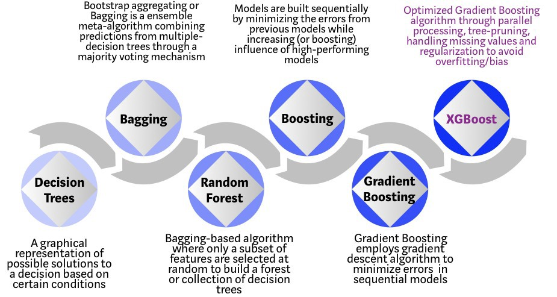
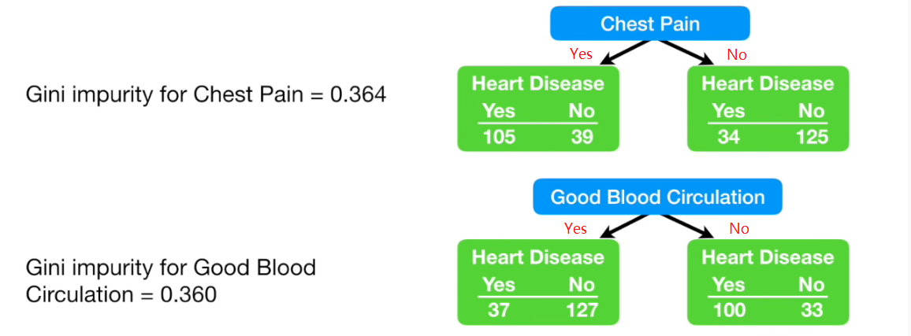

# Overview 
## Background 
A decision tree is a flowchart-like structure which models the decisions and their possible consequences, including chance of event outcomes, resource costs, and utility.

In a decision tree, each internal node is split by a single feature. The tree then develops branches leading to lower level of subgroups that increases the homogeneity of the elements within that group. The split on a feature is not influenced by other features. Such division process is repeated until all leaf nodes are reached. The paths from root to leaf represent classification rules.




## Libraries
A list of packages used in the recipes.

```{r Setup, message=FALSE, warning=FALSE, results='hide'}
library(rmdformats)     # theme for the HTML doc
library(bookdown)       # bibliography formatting
library(scales)         # data formatting  
library(dplyr)          # tidyverse: data manipulation
library(tidyr)          # tidyverse: tidy messy data
library(MASS)           # statistics
library(ggplot2)        # tidyverse: graphs
library(ggthemes)       # tidyverse: additional themes for ggplot, optional
library(pROC)           # visualising ROC curves
library(caret)          # for Classification And REgression Training
library(rpart)          # Decision tree algorithm
library(rpart.plot)     # Plot for decision tree
library(randomForest)   # random forest algorithm
library(xgboost)        # XGBoost algorithm
```

# Prepare Data
Let's use the same dataset as in the "Regression" section.

```{r Load data}
rm(list = ls())
load(file = "data.RData",)
```

Split data into training and testing set

```{r Split data, class.source = 'fold-show'}
# Determine the number of rows for training
nrow(df)
# Create a random sample of row IDs
sample_rows <- sample(nrow(df),0.75*nrow(df))
# Create the training dataset
df_train <- df[sample_rows,]
# Create the test dataset
df_test <- df[-sample_rows,]


samp_cv <- sample(1:nrow(df_test),100000)
df_cv <- df_test[samp_cv,]
df_test2 <- df_test[-samp_cv,]

# One hot encoding
train_label <- df_train$inc_count_tot
cv_label <- df_cv$inc_count_tot
test_label <- df_test2$inc_count_tot


```

# Decision tree
## Introduction of decision tree
Decision tree uses a technique called "divide-and-conquer", which is to divide the dataset into partitions with similar values for the outcome of interest. To divide-and-conquer, the algorithm looks for an initial split that creates the two most homogeneous groups, and repeat this process till all the leaf nodes are reached.

Leaf nodes represent the final outcome of all the determination, which are the lowest levels of a decision tree. It tells the classes (or types) of the output variable in classification problems, or its predicted values in regression problems.

The next question is, how does the algorithm decide where to split the dataset? For example, if one of the factors is "age", how does the model know to split it at age 30, 40, or 50, in order to achieve the best "two most homogeneous" groups? For classification trees, the common solutions are Gini impurity and Entropy.

### Gini impurity
Gini impurity is a common approach to calculate the goodness of split in a numeric way, which helps decide where to split the dataset.

Gini impurity is a measurement of the likelihood of an incorrect classification of the sample randomly selected. The lower the Gini impurity, the less likely a mis-classification will occur, and the subgroup is "purer". It reaches 0 when the dataset contains only one class ("purest" scenario).

Gini impurity is denoted as
$$G(x) = \sum_{i=1}^n P(x_i)(1 - P(x_i)) = 1 - \sum^n_{i=1} P(x_i)^2$$
where $p_k$ is the probability of a correct classification within the subgroup. 



In the example of whether having chest pain in relation to heart disease, the Gini impurity can be calculated as follows:

$$P_1 = P\text{(Has heart disease with chest pain)} = \frac{105}{105 + 39} = 0.7862$$
$$P_2 = P\text{(No heart disease with chest pain)} = \frac{39}{105 + 39} = 0.2708$$
$$P_3 = P\text{(Has heart disease without chest pain)} = \frac{34}{34 + 125} = 0.2138$$
$$P_4 = P\text{(No heart disease without chest pain)} = \frac{125}{34 + 125} = 0.7292$$
The Gini impurity for the left group is
$$ G(Left) = 1 - P_1^2 - P_2^2 = 0.3950$$
The Gini impurity for the right group is
$$ G(Right) = 1 - P_3^2 - P_4^2 = 0.3362$$
The overall Gini impurity for the division is a weighted average of the Gini impurity of the two groups, based on the number of observations within each group.
$$ G = \frac{144}{144 + 159} \times G(Left) + \frac{159}{144 + 159} \times G(Right) = 0.364$$

Similarly, the Gini impurity for whether having good blood circulation as condition is 0.360. In this case, it is a slightly better indicator than whether having chest pain. 

### Entropy
Entropy is a concept in information theory introduced by Claude Shannon in his 1948 paper "A Methematical Theory of Communication". It is denoted as follows
$$ H(x) =  - \sum_{i=1}^n P(x_i)ln(P(x_i))$$

Entropy varies between $[0, 1]$ while Gini impurity varies $[0,0.5]$. The two have very similar distribution especially when Entropy is compared to twice of the Gini impurity. The conclusion from the two are mostly the same (only disagree in 2% of time). In many cases Gini impurity is favoured, as Entropy requires more computational power for using log function.

## Classification tree example
Let's model whether a policy has any claim incident, by looking at indicator of sickness ($\text{inc_count_sick}$) and accident ($\text{inc_count_acc}$). Apparently the dependent variable ($\text{inc_count_tot}$) is fully determined by the two indicators. "Class" method is used here to train the classification tree.

```{r incidence modelling, class.source = 'fold-show'}
classi_tree <- rpart(inc_count_tot ~ inc_count_acc + inc_count_sick,
                        data = df_train,
                        method = "class")

plotcp(classi_tree, minline=TRUE)
rpart.plot(classi_tree)

```

As shown above, any policy having sickness or accident has a claim incident, in line with expectation.   


## Regression tree
A regression tree is basically a decision tree that is used for the task of regression which can be used to predict continuous valued outputs instead of discrete outputs.

Unlike classification tree, we cannot calculate the Gini impurity or entropy since we are predicting continuous variables. Therefore, another measure is required to tell how much our predictions deviate from the original target and that’s the entry-point of mean square error.

### Mean square error (MSE)
Mean square error is defined as
$$ MSE = \frac{1}{n} \sum_{i=1}^n (Y_i - \hat{Y}_i)^2 $$
where $Y_i$ is the actual value and $\hat{Y}_i$ is the predicted value. This is the same approach used in linear regression, which aims to minimise the difference between the actual and predicted values.

Note that regression tree uses piecewise linear functions, which fits a linear function to a certain interval. if we keep dividing the dataset, the tree is able to approach any kind of non-linear trends asymptotically. This is more flexible than simple linear regression.

## Regression tree example
Let's create a scenario where termination of claims is driven by age of the claimant. Decision tree will be used to split the dataset based on age and see if result is in line with our expectation.

### Data prep
```{r Termination Modelling data, class.source = 'fold-show'}
# select all claims
df_term <- df_train %>% filter(inc_count_tot >0) 

# add dummy claim duration data. Duration (i.e. in days) is usually considered following 
# an exponential distribution but in our recent study it follows a gamma distribution better. 
# To simplify, here we use exponential distribution CDF to back solve the x. 
# Assume lambda is 1/180 so that the average claim duration is 180 days.
df_term <- df_term %>% 
  mutate(term_day = case_when(age <= 45 ~ ceiling(log(1 - runif(nrow(df_term)))/(-1/90)),
                              age <= 50 ~ ceiling(log(1 - runif(nrow(df_term)))/(-1/180)),
                                   TRUE ~ ceiling(log(1 - runif(nrow(df_term)))/(-1/360))
                              ))

plot(df_term$age, df_term$term_day, xlab = "AGE", ylab = "Time to Recover (Days)")
```

### Fit regression tree

```{r Termination Modelling, class.source = 'fold-show'}
ageGroup_split <- rpart(term_day ~ age,
                        data = df_term,
                        method = "anova",
                        control = rpart.control(xval=5, minbucket=4, cp=0.0005))

plotcp(ageGroup_split, minline=TRUE)
rpart.plot(ageGroup_split)
printcp(ageGroup_split)

# increase cp the learning rate to prune the trees
ageGroup_pruned <- prune(ageGroup_split, cp=0.005)
rpart.plot(ageGroup_pruned)

```

The pruned tree splits the dataset into 3 subgroups which are exactly same as what has been defined in the data prep.


# Random forest
## Introduction of random forest
Random forest is an ensemble learning method that applies bootstrap aggregating, or Bagging, and a random selection of features, to enhance the overall performance by creating a number of trees. For classification tasks, the output of the random forest is the class selected by most trees. For regression tasks, the mean or average prediction of the individual trees is returned. Random forest controls over-fitting well.

## Train random forest model

```{r Random Forest for incidence projection}


new_train2 <- model.matrix(~ inc_count_tot  
                      + cal_year
                      + policy_year
                      + sex                           
                      + smoker
                      + benefit_period
                      + waiting_period
                      + occupation
                      + age          
                      + sum_assured             
                       , data = df_train)

new_cv2 <- model.matrix(~ inc_count_tot  
                      + cal_year
                      + policy_year
                      + sex                           
                      + smoker
                      + benefit_period
                      + waiting_period
                      + occupation
                      + age          
                      + sum_assured             
                       , data = df_cv)

new_test2 <- model.matrix(~ inc_count_tot  
                      + cal_year
                      + policy_year
                      + sex                           
                      + smoker
                      + benefit_period
                      + waiting_period
                      + occupation
                      + age          
                      + sum_assured             
                       , data = df_test2)

new_train2 <- as.data.frame(new_train2) %>% rename(., Default = "(Intercept)")
new_cv2 <- as.data.frame(new_cv2) %>% rename(., Default = "(Intercept)")
new_test2 <- as.data.frame(new_test2) %>% rename(., Default = "(Intercept)")

rf.fit = randomForest(as.factor(inc_count_tot) ~., data=new_train2, 
                      ntree=100, 
                      sampsize=c(500,500),
                      importance=T)

print(rf.fit)

# the number of variables tried at each split is based on following formula:
floor(sqrt(ncol(new_train2)-1))

varImpPlot(rf.fit)

rf.predict = predict(rf.fit, new_test2)
confusionMatrix(as.factor(rf.predict), as.factor(new_test2$inc_count_tot))

rf.predict2 = predict(rf.fit, new_test2, type="prob")
roc(new_test2$inc_count_tot ~ rf.predict2[,2], plot = TRUE, print.auc = TRUE)


```


# XGBoost
## Introduction of XGBoost
XGBoost was developed by Tianqi Chen, and is another well-known ensemble learning algorithm.

## Train XGBoost model

```{r xgboost for incidence prediction}


new_train <- model.matrix(inc_count_tot  ~ 
                        cal_year
                      + policy_year
                      + sex                           
                      + smoker
                      + benefit_period
                      + waiting_period
                      + occupation
                      + age          
                      + sum_assured             
                       , data = df_train)

new_cv <- model.matrix(inc_count_tot  ~ 
                        cal_year
                      + policy_year
                      + sex                           
                      + smoker
                      + benefit_period
                      + waiting_period
                      + occupation
                      + age          
                      + sum_assured             
                       , data = df_cv)

new_test <- model.matrix(inc_count_tot  ~ 
                        cal_year
                      + policy_year
                      + sex                           
                      + smoker
                      + benefit_period
                      + waiting_period
                      + occupation
                      + age          
                      + sum_assured             
                       , data = df_test2)


# prepare xgb matrix 
DM_train <- xgb.DMatrix(data = new_train, label = train_label) 
DM_cv <- xgb.DMatrix(data = new_cv, label = cv_label)
DM_test <- xgb.DMatrix(data = new_test, label = test_label)

# default hyper-parameters. Given the dataset is very imbalanced, we use 'scale_pos_weight' to re-balance it which is the number of negative observations (i.e. "0") over the number of positive observations (i.e. "1").
n_pos <- df_train %>% filter(inc_count_tot==1) %>% nrow(.)
n_neg <- df_train %>% filter(inc_count_tot==0) %>% nrow(.)

params <- list(booster = "gbtree"
               , objective = "binary:logistic"
               , eta=0.1
               , gamma=0
               , max_depth=6
               , min_child_weight=1
               , subsample=1
               , colsample_bytree=1
               , scale_pos_weight=n_neg/n_pos)

# xgb training with watchlist to show cross-validation
xgb1 <- xgb.train(params = params, data = DM_train, nrounds = 100, watchlist = list(train=DM_train, val=DM_cv)
                   ,print_every_n = 10
                   ,early_stopping_rounds = 50
                   ,maximize = F, eval_metric = "logloss")

summary(xgb1)
xgb_pred1 <- predict (xgb1, DM_test)

confusionMatrix(as.factor(as.numeric(xgb_pred1 >0.5)), as.factor(test_label))

roc(test_label ~ xgb_pred1, plot = TRUE, print.auc = TRUE)


```

