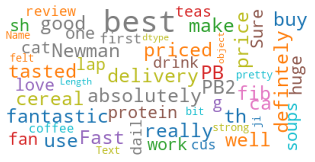

# Background and application

*...How do claim cause categories change over the lifetime of a claim? Could we distinguish between primary and secondary causes? Could we automate the allocation of a claim to a cause category and does this help limit the operational risk of mis-classification?...*

Most (life) insurers have some form of categorisation of claims into cause. This is often an input from the claims assessor into the admin system. Some businesses categorise claims into primary and secondary causes. 

This analysis considers methods of modelling topics or categories based upon the underlying text. This is useful where the classifications do not exist or we want to consider different classifications e.g. evolving claim drivers or secondary causes. Here we use customer review data, but the approach could be applied to claim file text in an insurance context. 

The approach could be extended by pairing raw cause text with existing cause mappings i.e. the models could be defined to learn the categories based upon existing classifications - that form of the problem is a more standard categorisation problem. More categorisation problems of that type are described in the recipes in the [Actuaries’ Analytical Cookbook](https://actuariesinstitute.github.io/cookbook/docs/textClassificationEntry.html), Natural Language Processing sections.

The methods below are not exhaustive but are are rather intended to be illustrative examples of topic modelling concepts to stimulate thinking. The articles in the further reading section expand on some of these thoughts. 

## Further reading
A few articles of interest:

* [Topic extraction using LDA](https://towardsdatascience.com/nlp-extracting-the-main-topics-from-your-dataset-using-lda-in-minutes-21486f5aa925) discusses using Latent Dirichlet Allocation (LDA) models. It highlights the simplifying assumptions of the models. The example dataset used in the article already has topics assigned to the data, showing the extension to classification problems.

* [Topic modelling with NMF](https://towardsdatascience.com/topic-modeling-articles-with-nmf-8c6b2a227a45) An example of topic modelling using Non-Negative Matrix Factorization (NMF).

* [Topic modelling with BERT](https://towardsdatascience.com/topic-modeling-with-bert-779f7db187e6) An example of topic modelling using Bidirectional Encoder Representations from Transformers (BERT).

* [Topic analysis](https://monkeylearn.com/topic-analysis/) discusses topic analysis in detail, similar to the article above.

* [Multi-label text classification](https://towardsdatascience.com/multi-label-text-classification-with-scikit-learn-30714b7819c5) and [Multi-Class Text Classification Model Comparison and Selection](https://towardsdatascience.com/multi-class-text-classification-model-comparison-and-selection-5eb066197568) consider a variety of classifier models to train against an existing label column. Includes methods of testing model accuracy.

* [Part of speech tagging](https://towardsdatascience.com/visualizing-part-of-speech-tags-with-nltk-and-spacy-42056fcd777e) sets out to extract and visualize part of speech in a piece of text. Could be extended to building a classification model on, for example, only nouns within the text.

* [Set up python in Rstudio with Reticulate](https://medium.com/save-the-data/how-to-use-python-in-r-with-reticulate-and-conda-36685534f06a) is an article setting out simple steps for using Python within Rstudio (Posit).

## Libraries
Setting up the environment as well as a list of some of the packages used in the recipe. For more on calling Python from within Rstudio/ Posit, see further reading.

```{r wrap-hook, include=FALSE}
library(knitr)
hook_output = knit_hooks$get('output')
knit_hooks$set(output = function(x, options) {
  # this hook is used only when the linewidth option is not NULL
  if (!is.null(n <- options$linewidth)) {
    x = xfun::split_lines(x)
    # any lines wider than n should be wrapped
    if (any(nchar(x) > n)) x = strwrap(x, width = n)
    x = paste(x, collapse = '\n')
  }
  hook_output(x, options)
})
```

```{r Setup environment, message=FALSE, warning=FALSE, results='hide'}

# calling python from r
library(reticulate) 

# create environment if does not exist
# conda_create("r-reticulate") 
# py_config() # to check configuration

# activate environment
use_condaenv("r-reticulate", required=TRUE) # set environment before running any Python chunks

# if not already installed, install the below. if env specified, can drop envname parameter

# py_install("pandas",envname = "r-reticulate")
# py_install("numpy",envname = "r-reticulate")
# ...etc

```

Libraries:

```{python Libraries, message=FALSE, warning=FALSE, results='hide'}

# import some standard libraries
import pandas as pd
import numpy as np
import random
```

# Data
## Extraction
The sections below analyse customer review data sourced from [Kaggle: Amazon Customer Reviews](https://www.kaggle.com/datasets/vivekprajapati2048/amazon-customer-reviews). 

This dataset is not appropriate for publication and has been anonymised, but is nevertheless useful for illustrative purposes here. 

Extracting a sample of 20k reviews from the set. Of interest are the 'Summary' and 'Text' as these are the text of the reviews. The analysis is conducted on the 'Text' column.

```{python Data extraction, message=FALSE, warning=FALSE,results = 'hold', code_folding=TRUE}

# full dataset saved as reviews_clean
# data_full = pd.read_csv('reviews_clean.csv')
# len(data_full)

# we're taking a sample from the dataset, already extracted to reviews_sample
# data = data_full.sample(n=20000)
# data.to_csv(r'.\reviews_sample.csv', index = False, header=True)

# import sample
data = pd.read_csv('reviews_sample.csv')
pd.set_option('display.max_rows', 500)
pd.set_option('display.max_columns', 500)
pd.set_option('display.width', 150)
print('Data head')
print('-------------------------------------------')
data.head()
print('-------------------------------------------')
```

Extracting column names:

```{python Data extraction - column headers, message=FALSE, warning=FALSE,results = 'hold', code_folding=TRUE, linewidth=80}
print('Column names')
print('-------------------------------------------')
# List out column names
list(data.columns)
```

The review columns are converted to lists for processing.

```{python Data convert to list}
# Convert comment/ text column to list
text = data['Text'].values.tolist()
text_summary = data['Summary'].values.tolist()
```

Printing a sample of 5 reviews:

```{python Data sample, code_folding=TRUE}
review_sample = data.sample(5)
  # The 'sample' method in the 'random' package selects, without replacement,
  # the number of items you want from a list.

for i in range(len(review_sample)):
  print(review_sample.iloc[i,:])

```

# Topic modelling
## What is topic modelling?

In machine learning and natural language processing, a topic model is a type of statistical model for discovering the abstract "topics" that occur in a collection of documents. Topic modeling is a frequently used text-mining tool for discovery of hidden semantic structures in a text body. 

Intuitively, given that a document is about a particular topic, one would expect particular words to appear in the document more or less frequently: "dog" and "bone" will appear more often in documents about dogs, "cat" and "meow" will appear in documents about cats, and "the" and "is" will appear equally in both. A document typically concerns multiple topics in different proportions; thus, in a document that is 10% about cats and 90% about dogs, there would probably be about 9 times more dog words than cat words.

The "topics" produced by topic modeling techniques are clusters of similar words. A topic model captures this intuition in a mathematical framework, which allows examining a set of documents and discovering, based on the statistics of the words in each, what the topics might be and what each document's balance of topics is. It involves various techniques of dimensionality reduction(mostly non-linear) and unsupervised learning like LDA, SVD, autoencoders etc.

Source: [Wikipedia](https://en.wikipedia.org/wiki/Topic_model)

## Wordcloud

Below is an exploratory word cloud of the words in the review text:

```{python Exploratory word cloud, message=FALSE, warning=FALSE, results='hide'}
from wordcloud import WordCloud, STOPWORDS
from matplotlib import pyplot as plt
import matplotlib.colors as mcolors

cols = [color for name, color in mcolors.TABLEAU_COLORS.items()]

cloud = WordCloud(
    background_color='white',
    stopwords=set(STOPWORDS),
    max_words=200,
    colormap='tab10',
    contour_color='steelblue',
    max_font_size=40, 
    random_state=42
)

cloud.generate(str(data['Text'])) 
plt.gca().imshow(cloud)
plt.gca().axis('off')
plt.margins(x=10, y=10)
plt.tight_layout()

plt.savefig('img/prev_topic.png', bbox_inches='tight') # or use plt.show()
```



## Review lengths

A few summary stats on the length of the reviews and words within the reviews using code from the [Actuaries Insitute Coookbook](https://actuariesinstitute.github.io/cookbook/docs/index.html), NLP section:

```{python Exploratory analysis 1, results = 'hold', code_folding=TRUE}

# From the NLP recipe section...

# Check the length of different reviews.
# A list constructor is used to produce a list of how long each review is
# in characters. 
review_length_characters = [len(t) for t in text]

# Print summary statistics for the number of characters in each review.
print('The longest character length in a review is {:,}.'.format(max(review_length_characters)))
print('The shortest character length in a review is {:,}.'.format(min(review_length_characters)))
print('The average character length of reviews is {:.0f}.'.format(np.mean(review_length_characters)))
print('The median character length of reviews is {:.0f}.'.format(np.median(review_length_characters)))
print()

# A list constructor is used to produce a list of how long each review is
# in words.
review_length_words = [len(t.split()) for t in text]
# The str.split() function breaks a string by approximate word breaks. 

## Print summary statistics for the number of words in each review.
print('The longest word length in a review is {:,}.'.format(max(review_length_words)))
print('The shortest word length in a review is {:,}.'.format(min(review_length_words)))
print('The average word length of reviews is {:.0f}.'.format(np.mean(review_length_words)))
print('The median word lenth of reviews is {:.0f}.'.format(np.median(review_length_words)))

```

A histogram of the character lengths of the review text shows that most reviews are shorter than, say, 750 words.

```{python Exploratory analysis 2, results = 'hide'}
# Histogram of comment lengths
plt.clf()
text_length = data['Text'].str.len()
hist = text_length.hist(bins = np.arange(0,2000,50))

plt.gca().axis('on')
plt.title('Review lenghts, histogram')
plt.xlabel('text length (characters)')
plt.tight_layout()
plt.show()
```

Extracting some of the shortest reviews and the longest:

```{python Exploratory analysis 3, results = 'hold', code_folding=TRUE, linewidth=80}
# Print some examples of the shortest and longest reviews.
review_and_length = [(t[:300],len(t.split())) for t in text]
short_reviews = list(filter(lambda c: c[1] < 12, review_and_length))
long_reviews = list(filter(lambda c: c[1] > 1900, review_and_length))
print('Sample short reviews:')
print(*short_reviews,sep='\n')
print('\nSample longest review (limit to 300 charaters):')
print(long_reviews)
```

## Model preamble

The following chunk is setup for the NLP model, including importing:

* regular expressions to help define sentences and words
* stopwords for exclusion from the models
* [lemmatization](https://en.wikipedia.org/wiki/Lemmatisation): "the process of grouping together the inflected forms of a word so they can be analysed as a single item, identified by the word's lemma, or dictionary form."
* [stemming](https://en.wikipedia.org/wiki/Stemming): "the process of reducing inflected (or sometimes derived) words to their word stem, base or root form—generally a written word form."
* other tools for defining the NLP models and their visualisation.

Import libraries for text cleaning and model build:

``` {python NLP pre-amble, message=FALSE, warning=FALSE, results='hide'}
# Regex
import re

# Stopwords
import nltk
nltk.download('stopwords')
from nltk.corpus import stopwords
stop_words = stopwords.words('english')
stop_words.append('a')
stop_words.append('br')
stop_words.append('www')
stop_words.append('http')

# Lemmatisation
from nltk.stem import WordNetLemmatizer
lemmatizer = WordNetLemmatizer()

# Stemming 
from nltk.stem import PorterStemmer
stemmer = PorterStemmer()

# Gensim -  topic modelling, document indexing and 
#           similarity retrieval with large corpora.
import gensim
import gensim.corpora as corpora
from gensim.utils import simple_preprocess
from gensim.models import CoherenceModel

# Plotting tools
import pyLDAvis
import pyLDAvis.gensim_models  

import warnings
warnings.filterwarnings("ignore",category=DeprecationWarning)
```

## Text processing

The sections below are built off existing code sourced from [Kaggle on topic modelling](https://www.kaggle.com/code/anuvagoyal/topic-model). 

Taking the raw text data and processing it into words, removing stopwords (and short words), stemming and lemmatizing:

``` {python Text processing}
filtered_text = []     

# Here looping through the smaller 20k sample, but can extend to the full list
for t in text:
  
  filtered_sentence = ""
  stemmed_list = []
  lemmatized_list = []
  
  sentence = str(t)
  
  # Data Cleansing
  sentence = re.sub(r'[^\w\s]', ' ', sentence)
  
  # Removing numbers
  sentence = re.sub(r'[0-9]', '', sentence)
  
  # Tokenization
  words = nltk.word_tokenize(sentence)
  
  # Convert the tokens into lowercase: lower_tokens
  words = [w.lower() for w in words]
  
  # Stop words removal
  words = [w for w in words if not w in stop_words]
  
  # Stemming
  for word in words:
    stemmed_word = stemmer.stem(word)
    stemmed_list.append(stemmed_word)
  
  # Lemmatization
  for s_word in stemmed_list:
    lemmatized_word = lemmatizer.lemmatize(s_word)
    lemmatized_list.append(lemmatized_word)
  
  lemmatized_list = [i for i in lemmatized_list if len(i) >= 3]
  
  filtered_text.append(lemmatized_list) 
```

## Review processed text

Reviewing the processed text shows the impact of removing stopwords etc. 

Note that the data prep can lead to the loss of some descriptive data e.g. comment 5, referenced 'PB', which is an abbreviation for 'peanut butter', but our prep phase stripped out 2 letter words from the data.

```{python Review processed text, results = 'hold', code_folding=TRUE, linewidth=80}

print('Row count, pre:',format(len(text)))
print('-------------------------------------------')
# confirm all of the 20k reviews processed
print('Row count, post:',format(len(filtered_text)))
print('-------------------------------------------')

# sample text from 6th and 500th review, pre and post-processing
print('Pre-processed 6th review:',format(text[5]))
print('-------------------------------------------')
print('Processed 6th review:',format(filtered_text[5]))
print('-------------------------------------------')
print('Pre-processed 500th review:',format(text[499]))
print('-------------------------------------------')
print('Processed 500th review:',format(filtered_text[499]))

```

## Most common words

Looking at the 20 most common words by count shows that the reviews understandably contain some form of opinion - we could consider stripping out adjectives to attempt to address this. There is also some clear indication of the types of products under review, which is of interest to us.

```{python Exploratory analysis counter, results = 'hold'}
from collections import Counter
# Print the 20 most common words across the whole corpus of complaints.
word_count = Counter([word for t in filtered_text for word in t])

print("{:<6} {:>12}".format("Word", "Count"))
print("{:<6} {:>12}".format("----", "----------"))
for word, count in word_count.most_common(20): print("{:<6} {:>12,}".format(word, count))
# 'most_common' is a helpful method that can be applied to Counter.

```

## Dictionary, corpus and model

Using the filtered text to create a corpus and dictionary for use in the model, where

* Corpus: Is a large body of text used to train the model, here the text of the comments.

* Dictionary: Is the collection of words used to train the model, here the words within the text of the comments.


```{python Dictionary and Corpus, results = 'hold', code_folding=TRUE, linewidth=80}
# Create Dictionary
id2word = corpora.Dictionary(filtered_text)

# Create Corpus
texts = filtered_text

# Term Document Frequency
corpus = [id2word.doc2bow(text) for text in texts]

# View
# print(corpus), large
print('Dictionary, 100th word:', format(id2word[99]))
print('-------------------------------------------')
print('Length of corpus:',format(len(corpus)))
print('-------------------------------------------')
print('Readable format of corpus (term-frequency):', format([[(id2word[id], freq) for id, freq in cp] for cp in corpus[:1]]))
```

Fitting a [Latent Dirichlet Allocation (LDA)](https://www.jmlr.org/papers/volume3/blei03a/blei03a.pdf) model. This method builds a model for topic per review and a model for words per topic, modelled as Dirichlet distributions. A further example application [here](https://towardsdatascience.com/topic-modeling-and-latent-dirichlet-allocation-in-python-9bf156893c24).

There are a number of alternative model forms, in particular when the problem is viewed as a more standard categorisation/ classification problem where the predicted value is the label and the model is fit to pre-labelled data e.g. logistic regression. This recipe does not consider the relative suitability of the model - this could be explored further. Model parameterisation could be further refined, e.g. considering [bi-grams](https://en.wikipedia.org/wiki/N-gram) rather than single words.

```{python LDA model}
lda_model = gensim.models.ldamodel.LdaModel(corpus=corpus,
                                           id2word=id2word,
                                           num_topics=10, 
                                           random_state=0,
                                           update_every=1,
                                           chunksize=100,
                                           passes=10,
                                           alpha='auto',
                                           per_word_topics=True)
```

Print out the key words for each of the topics:

```{python Topic key words, message=FALSE, warning=FALSE, code_folding=TRUE}
# Print the keywords in the topics
from pprint import pprint
pprint(lda_model.print_topics())
doc_lda = lda_model[corpus]
```

Extract the topics for a sample comment. This shows a comment about tea which is attributed to topic 1 with ~21% probability and topic 3 with ~16% probability. We'll see in the wordcloud below that topic 3 might be more appropriate and that it might be possible to refine the model by removing certain words e.g. adjectives.

```{python Sample text topic, message=FALSE, warning=FALSE, results = 'hold', code_folding=TRUE, linewidth=80}
print('Pre-processed 6th review:',format(text[5]))
print('-------------------------------------------')
print('Processed 6th review:',format(filtered_text[5]))
print('-------------------------------------------')
print('6th review corpus:',format(corpus[5]))
print('-------------------------------------------')
print('6th review topic probability:')
lda_model.get_document_topics(corpus[5], minimum_probability=None, minimum_phi_value=None, per_word_topics=False)
```

Model test metrics extracted below, see [this article](https://towardsdatascience.com/evaluate-topic-model-in-python-latent-dirichlet-allocation-lda-7d57484bb5d0) for more on these metrics - it also covers off using coherence to optimize the number of topics modelled. Useful for model comparison.

* Model perplexity: "[Y]ou can think of the perplexity metric as measuring how probable some new unseen data is given the model that was learned earlier. That is to say, how well does the model represent or reproduce the statistics of the held-out data."

* Coherence: Where there is "semantic similarity between high scoring words in the topic." 

```{python Model Perplexity and Coherence Score, linewidth=80}
# Compute Perplexity
print('\nPerplexity: ', lda_model.log_perplexity(corpus))  # a measure of how good the model is. lower the better.
#calculating and displaying the coherence score
coherence_model_lda = CoherenceModel(model=lda_model, corpus=corpus, coherence='u_mass')
coherence_lda = coherence_model_lda.get_coherence()
print('\nCoherence Score: ', coherence_lda)
```

Plotting word clouds for each of the topics:

```{python Topic word cloud, message=FALSE, warning=FALSE, results='hide', code_folding=TRUE}
# Visualize the topics
import matplotlib.colors as mcolors

cols = [color for name, color in mcolors.TABLEAU_COLORS.items()]  # more colors: 'mcolors.XKCD_COLORS'

cloud = WordCloud(stopwords=stop_words,
                  background_color='white',
                  width=2500,
                  height=1800,
                  max_words=30,
                  colormap='tab10',
                  contour_color='steelblue',
                  color_func=lambda *args, **kwargs: cols[i])

topics = lda_model.show_topics(formatted=False)

fig, axes = plt.subplots(5, 2, figsize=(10,10), sharex=True, sharey=True)

for i, ax in enumerate(axes.flatten()):
    fig.add_subplot(ax)
    topic_words = dict(topics[i][1])
    cloud.generate_from_frequencies(topic_words, max_font_size=300)
    plt.gca().imshow(cloud)
    plt.gca().set_title('Topic ' + str(i), fontdict=dict(size=16))
    plt.gca().axis('off')


plt.subplots_adjust(wspace=20, hspace=20)
plt.axis('off')
plt.margins(x=10, y=10)
plt.tight_layout()
plt.show()
```

# Observations 
It is clear from the key words and wordclouds that there is somewhat effective grouping for certain topics (life topic 4, roughly "drinks"), but not others (life topic 1). We could consider pairing with existing categorisation data and train against that. Alternatively, we could strip back the tokens to remove adjectives and focus the model on nouns - we are not that interested in sentiment. 

We could also consider changing the number of topics modelled, optimizing model coherance. 

In insurance applications, the outcome will rely upon the amount of data we have for each distinct topic e.g. the model may be able to distinguish cancers from mental illness but increasing the number of topics assessed will not necessarily lead to further refined mental illness topics.

The review text used here was chosen as it is broadly analogous to a selection of insurance claim cause texts, however there is likely to be a much greater variety in the products reviewed (and hence hard to derive broad topics) compared to the claim cause categories in insurance data. 