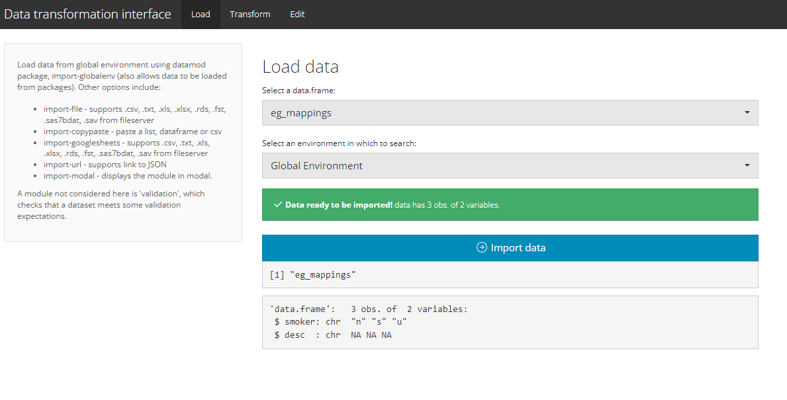
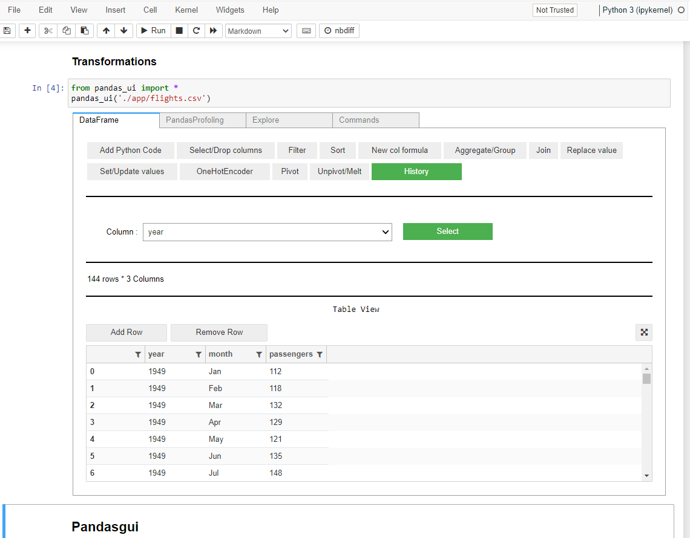

# Background 

*...Is there a low-code data-transformation solution in Python or R? Is there a visual way to transform tables in R? And a way to edit data directly in R? ...*

These recipes consider low-code interface solutions for simple editing and transformation problems outside of more formalised extract-transform-load pipelines. 

There are a number of fantastic low code/ graphical interface solutions for bigger data load and transformation problems including [Alteryx](https://www.alteryx.com/) (closed source) and [Apache NiFi](https://nifi.apache.org/) (open source). 

The solutions considered here are bolt-on options for existing R or Python processes with the benefit of not requiring much work to set up.

## Shiny and R

Two very useful packages allow direct visual editing and transformation of r tables through shiny:

* [Datamods](https://cran.r-project.org/web/packages/datamods/datamods.pdf) is a package of shiny modules to import and manipulate data.
* [rhandsontable](https://cran.r-project.org/web/packages/rhandsontable/vignettes/intro_rhandsontable.html) is an htmlwidget with an Excel-like appearance. It comes with powerful features like data validation, sorting, grouping, data binding, formula support or column ordering.

A bare-bones app using the above is here:

[{width=100%}](https://pat-reen.shinyapps.io/data-ui/)

## Python

There are a few existing packages that deal with most of the standard transformation problems an end user might usually encounter, e.g.

* [Pandas_ui](https://medium.com/@arunnbaba/pandas-ui-87316a4e19c7) discusses the usage of this package as a user interface tool for fast data manipulation in pandas.
* [PandasGUI](https://towardsdatascience.com/pandasgui-analyzing-pandas-dataframes-with-a-graphical-user-interface-36f5c1357b1d) similarly discusses data analysis using the PandasGUI interface.
* [Bamboolib](https://towardsdatascience.com/bamboolib-one-of-the-most-useful-python-libraries-you-have-ever-seen-6ce331685bb7) discusses using the Bamboolib Python package for low-code data transformation work. Unlike the others, Bamboolib is closed source and owned by Databricks.

The first two options are considered in a demo, available on github:

[{width=100%}](https://github.com/Pat-Reen/More-Modelling-Recipes/tree/main/_posts/2022-11-10-ui-data)
Source: https://medium.com/@arunnbaba/pandas-ui-87316a4e19c7

